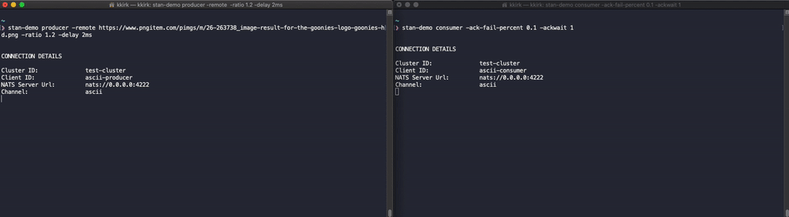
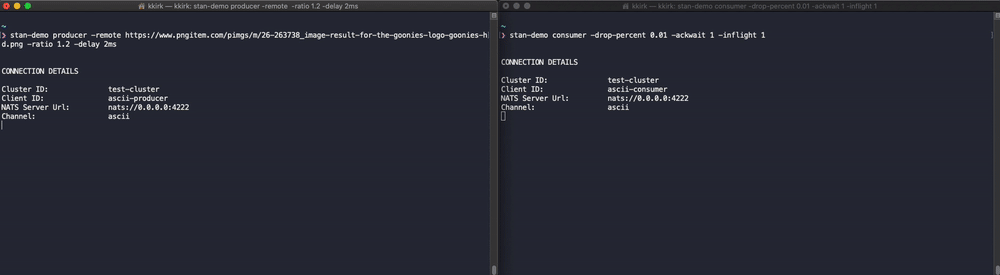
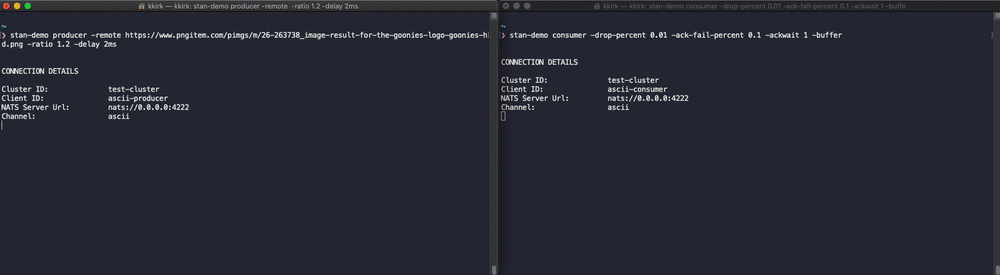

# Dropped and Duplicate Events

Because NATS Streaming provides a level of persistence and At-Least-Once delivery, we can be assured that our subscribed
clients will receive all messages. However, At-Least-Once delivery, by itself, does not guarantee strict sequencing.

There are two primary ways that events can be received and potentially processed out of order: Dropped Events and Failure to Acknowledge events.

We can use these examples to visualize how these issues manifest and also preview a few ways we can work around them
using both built in features of NATS Streaming as well as our own solutions.

### Dropped Events

In the case of Dropped Events, this primarily assumes that a consumer crashes or becomes unreachable after receiving an 
event, but before it can be processed or acknowledged. In this scenario, NATS Streaming will wait for the configured
`AckWait` timeout and then resend the message. Depending on how many messages the consumer allows inflight awaiting acks,
this means that the Consumer may move on to the next event and would later get the dropped event back, out of sequence.

We can simulate this scenario by adding a new option to our consumer, feeding it the percentage of messages we want to 
force it to drop.

##### Producer
```
#> event-stream-demo producer -remote https://www.pngitem.com/pimgs/m/26-263738_image-result-for-the-goonies-logo-goonies-hd.png
```

##### Consumer 1

We add the `drop-percent` option set to 10% and include the `ackwait` option strictly to speed up the timeout. 
In a real world scenario, that `ackwait` setting would determine the amount of time to wait (in seconds)
before the message is resent - for this demo, we want to speed that up so we're not waiting overly long.

```
#> event-stream-demo consumer -drop-percent 0.1 -ackwait 1
```


### Duplicate Events

Duplicate events are still predicated on our Consumer failing to acknowledge the event that it received. However, in this
scenario, we assume that the failure to acknowledge happens AFTER we've already processed the event. There is a reality
where we could end up with partially processed events, but that's rather complex to show or deal with. 

We can simulate this scenario by adding a new option to our consumer, feeding it the percentage of messages we want to 
fail acknowledgement. In this scenario, messages are printed to the screen, but then redelivered later, showing up
as extra / duplicate characters.

##### Producer
```
#> event-stream-demo producer -remote https://www.pngitem.com/pimgs/m/26-263738_image-result-for-the-goonies-logo-goonies-hd.png
```

##### Consumer 1

We add the `ack-fail-percent` option set to 10% and include the `ackwait` option strictly to speed up the timeout. 

```
#> event-stream-demo consumer -ack-fail-percent 0.1 -ackwait 1
```



### Forcing Serial Processing

One way to handle the problems described above is to use a setting on Subscriptions called `MaxInFlight`. Typically, this 
setting allows NATS Streaming to send batches of events to a subscribed client where it will process them in order and send
back Acknowledgement for the message.  By setting this option down to 1, it ensures that every message is processed in order
- as the server waits for the acknowledgement before sending the next.  If that acknowledgement does not come, the same
message is redelivered.

We can do that easily on our consumer by setting the consumer to drop a percentage of messages while also providing the 
`-inflight` option. Though, there is a rightfully a performance trade off to doing so - which becomes visible in the way
the consumer pauses at intervals. This is when a message drops and we have to wait for the Ack to timeout and the event
to be redelivered before moving on. See the example below.

##### Producer
```
#> event-stream-demo producer -remote https://www.pngitem.com/pimgs/m/26-263738_image-result-for-the-goonies-logo-goonies-hd.png
```

##### Consumer 1

We set the `inflight` option to a value of 1. 

```
#> event-stream-demo consumer -drop-percent 0.1 -ackwait 1 -inflight 1
```



### Handling Out of Order Events with Buffering

Another way we might attempt to protect against both out of sequence and duplicate events is through the use
of buffer. Included in this demo is a naive, non-distributed - but fully functioning in memory buffer that
allows our consumer to pause printing only when it detects a potential gap in the sequence of events.

This allows for us to utilize the default behavior of events being delivered in batches, but ensure that events that arrive
out of order or duplicated are either re-ordered or properly ignored. This provides a good trade off between performance
and strict sequencing with out moving to serial operations.

We can demonstrate this by adding a new option to the consumer. To really showcase this, this example provides a 
percentage chance to both drop messages and otherwise fail to acknowledge them. 

##### Producer
We increase the ratio from the default a little bit here, just to increase the number of events.
```
#> event-stream-demo producer -remote https://www.pngitem.com/pimgs/m/26-263738_image-result-for-the-goonies-logo-goonies-hd.png -ratio 0.1
```

##### Consumer 1

We include both `ack-fail-percent` and `drop-percent` meaning roughly 30% of messages are dropped or unacknowledged - we
also add the new `buffer` option to include our in-memory buffering. 

```
#> event-stream-demo consumer -ack-fail-precent 0.1 -drop-percent 0.2 -ackwait 1 -buffer
```

