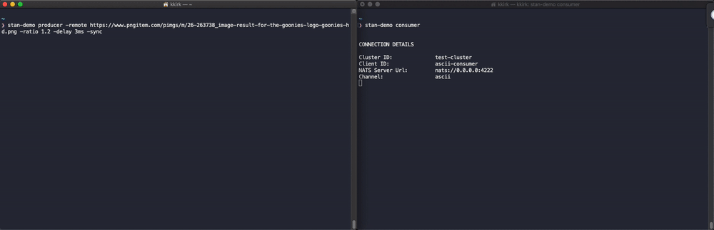
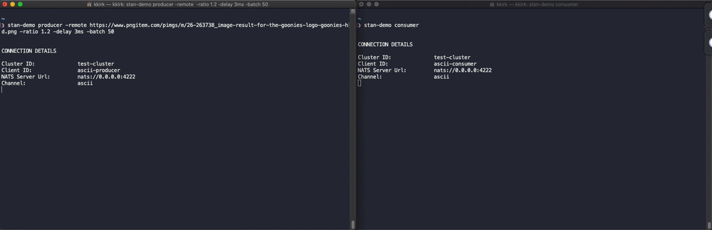

# Publishing Events

There are a few modes of Publishing that can be leveraged depending on uses cases and demand for strict sequencing, etc. 
These are reviewed below.

### Asynchronous Producers

The default behavior for this demo is to publish events asynchronously - providing the NATS
Streaming client with a callback function that is invoked when the server has properly acknowledged
receipt of the message. This greatly increases the throughput of a producer. The trade off is that
if an event is not properly acknowledged the Producer would need to resend that event, now, most likely out of
sequence.

This is easily to see from the basic example, below.

##### Producer
```
#> event-stream-demo producer -remote https://www.pngitem.com/pimgs/m/26-263738_image-result-for-the-goonies-logo-goonies-hd.png
```

##### Consumer
```
#> event-stream-demo consumer
```


### Synchronous Publishing

The NATS Streaming client can also publish events in a synchronous manner, blocking until an event has been acknowledged
or an error received.  This means that retries on the event can happen before any other event is sent, providing a strict
sequence of events at a lower throughput.

We can easily demo this by passing the `-sync` argument to our Producer, see below.

##### Producer
We add the `sync` option here, to force synchronous publishing.
```
#> event-stream-demo producer -remote https://www.pngitem.com/pimgs/m/26-263738_image-result-for-the-goonies-logo-goonies-hd.png -sync
```

##### Consumer
```
#> event-stream-demo consumer
```



### Manually Batching

A potential optimization that we can make, where possible, is to batch events by combining them into a single NATS Streaming
event. There are a few trade-offs to consider: our consumers must be aware that each event received must be iterated over and
that our sequencing and ordering needs to be maintained with in each batch.  

Lastly, more effort should be made to understand
the performance characteristic of differing message sizes (at scale, is more small messages more performant than fewer 
larger messages, etc.)

We can demonstrate how this effects throughput by indicating a `batch` size on the Producer, see below.

##### Producer
We add the `sync` option here, to force synchronous publishing.
```
#> event-stream-demo producer -remote https://www.pngitem.com/pimgs/m/26-263738_image-result-for-the-goonies-logo-goonies-hd.png -batch 50
```

##### Consumer
```
#> event-stream-demo consumer
```

