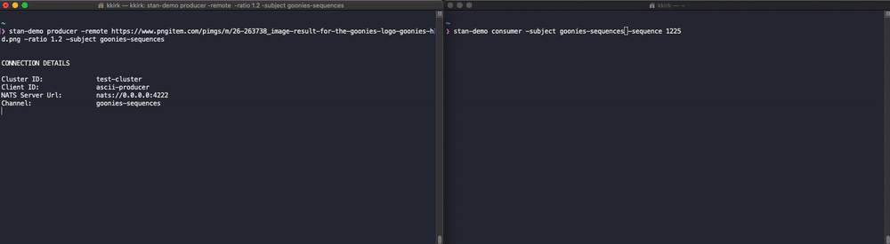

# Starting Offsets & Replaying Events

NATS Streaming is an event log that can be tailed (subscribed to) or replayed in various ways.
This gives us flexibility and potential for code reuse when it becomes necessary to reprocess
events in order to fix data integrity or data consistency issues.

NATS Streaming allows multiple ways for a Subscription to decide where in the event log it would like to start.
- Starting at Last Message Received
- The very beginning of the event log
- A specific Sequence ID
- A specific time 

We can use this demo to view how most of these options work.

### Tail A Channel

A common use case is to have a Subscription start at `time.Now()`, meaning only looking for messages
from the time it subscribed moving forward. This is akin to tailing a log file, only watching for new 
lines.

This is easy to view by just starting a Consumer after a Producer has already delivered messages. In the
example below, the Consumer will stay waiting for messages, but not displaying any that had been sent before
it established its subscription. See below.

##### Producer
```
#> event-stream-demo producer -remote https://www.pngitem.com/pimgs/m/26-263738_image-result-for-the-goonies-logo-goonies-hd.png
```

##### Consumer
Wait until after the producer is finished before starting the consumer.
```
#> event-stream-demo consumer
```


### Receive All Available Messages

Another use case might be starting a consumer and asking it to start at the very beginning of the available messages in 
the Channel and working its way forward. In this case, once it becomes current, it automatically becomes a tailing subscriber,
processing any new events as they are published. 

We can easily show this by publishing a new image, then starting a Consumer with a new option to change the starting 
position to start at the beginning of the channel. See below.

##### Producer
Be sure to use a unique subject name, to make sure you are starting with an empty channel.
```
#> event-stream-demo producer -remote https://www.pngitem.com/pimgs/m/26-263738_image-result-for-the-goonies-logo-goonies-hd.png -subject `goonies`
```

##### Consumer
Wait until the producer is finished, then start the Consumer. Ensure we use the same `subject` as above and use the `offset` option set to `all`.
```
#> event-stream-demo consumer -subject goonies -offset all
```


### Receive Messages Starting From a Specific ID

The last use case we can easily demonstrate is the ability to start a Consumer from a known ID. This would be extremely
helpful in scenarios where we have identified a failure want to reprocess all events starting from the flagged Sequence ID.

For the sake of the demo here, we can cheat this by knowing that all new Channels start at Sequence ID of 1 and further,
that the image we've used in all of these demos with the default `ratio` generate 897 events. So, we have our Producer
send messages to a new, unique Subject, then have our Consumer start with the `-sequence` option with a number picked
between 1 and 897.  See below.

##### Producer
Be sure to use a unique subject name, to make sure you are starting with an empty channel.
```
#> event-stream-demo producer -remote https://www.pngitem.com/pimgs/m/26-263738_image-result-for-the-goonies-logo-goonies-hd.png -subject goonies-sequence-id
```

##### Consumer
Wait until the producer is finished, then start the Consumer. Ensure we use the same `subject` as above and use the `sequence` between 1 and the Total Sent count from the Producer.
```
#> event-stream-demo consumer -subject  goonies-sequence-id -sequence 449
```

