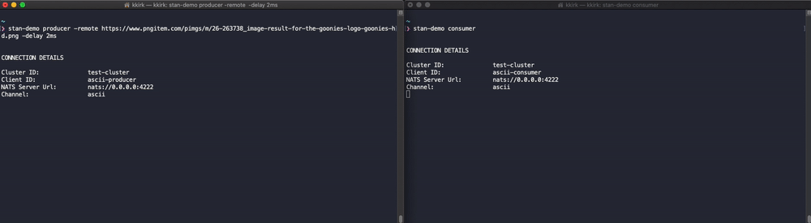
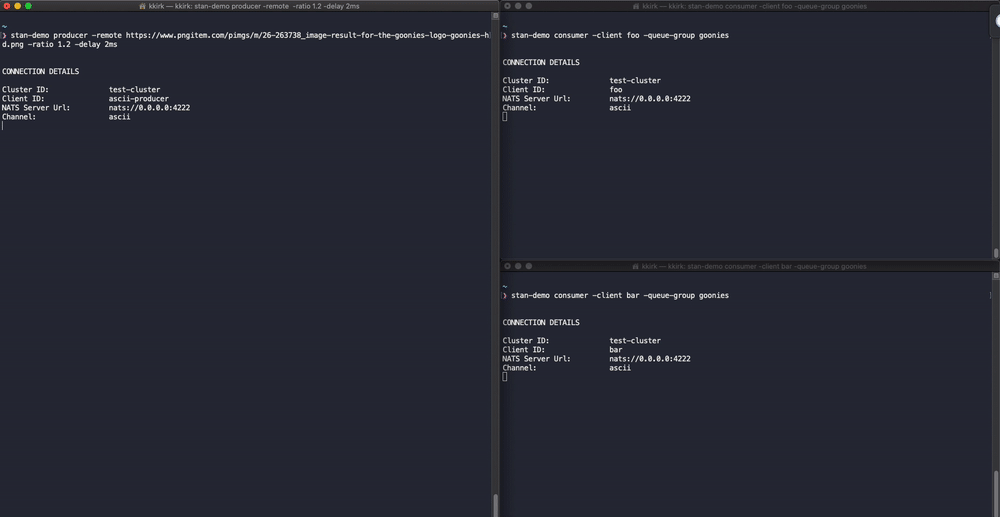

# Subscription Types

There are a few different ways that consumers can subscribe to Subjects in NATS Streaming which we cover below:
- Standard Subscriptions
- Durable Subscriptions
- Queue Group Subscriptions
- Durable Queue Group Subscriptions

### Standard Subscription

The most basic example is just using a Publisher to generate an ASCII Image and pushing it through to a consumer. This can
be accomplished with two terminal windows. Barring any network issues or interruptions on your host machine, the image
should be published and displayed in a pretty quick manner.  Feel free to use any publicly accessible image url. 

We can use the same basic example from Publishing, below.

##### Producer
```
#> event-stream-demo producer -remote https://www.pngitem.com/pimgs/m/26-263738_image-result-for-the-goonies-logo-goonies-hd.png
```

##### Consumer
```
#> event-stream-demo consumer
```



### Durable Consumers

Durable Subscriptions with NATS Streaming take an extra step in persistence to maintain checkpoints for Subscriptions 
with regard to what messages have been delivered and which still need to be delivered. The goal here is to handle
cases where the subscribed client(s) might become unreachable. Any client that reconnects with the same Durable 
identifier can automatically pick up where it last left off.

In the example below, you can see that we start both Producer and Consumer, then restart the Consumer while the Producer 
is still running. NATS Streaming doesn't miss a beat and it begins delivering events to the reconnected consumer right
where it left off.

If you look closely in the image, you'll see that the sum of total messages delivered before the reconnect and afterward
for the Consumer properly matches the total sent by the Producer.  All messages were delivered properly even with the 
interruption in the middle.

##### Producer
```
#> event-stream-demo producer -remote https://www.pngitem.com/pimgs/m/26-263738_image-result-for-the-goonies-logo-goonies-hd.png
```

##### Consumer 1
We need to set an identifier for the Durable subscription
```
#> event-stream-demo consumer -durable rememberme
```


### Multiple Consumers

Another scenario is around event message fan out. Say we have one producer generating events that N number of consumers
care about. You can have as many unique consumers listening on a subject as you'd like, each has its own state for which
messages its received and acknowledged. 

Further, the stability of individual consumers don't affect any other consumers. We can display this by introducing an option
into one of the consumers to cause it to fumble and drop messages a percentage of time. It's clear to see that the first consumer
receives all messages correctly in order regardless of the other consumer.

##### Producer
```
#> event-stream-demo producer -remote https://www.pngitem.com/pimgs/m/26-263738_image-result-for-the-goonies-logo-goonies-hd.png -batch 100 -ratio 0.12
```

##### Consumer 1
We need to set a unique Client ID for the client, now that we're running more than one
```
#> event-stream-demo consumer -client foo
```

##### Consumer 2

On top of a unique Client ID, we also set this consumer to drop 10% of events and lower the amount of time NATS Streaming
will wait for an acknowledgement before resending messages.
```
#> event-stream-demo consumer -client bar -drop-percent 0.1 -ackwait 1
```


### Queue Groups

Queue Groups allow us to horizontally scale our consumers while helping to ensure that each Message is processed only once. In a
Queue Group Subscription, events are delivered across the members of the Queue Group in a round robin, but each event is
only delivered to the group once - unless the receiving client fails to acknowledge the message. When a message is not
acknowledged after the configured timeout, it is redelivered to the Queue Group.

In the example below, you can see that the ASCII characters of the image are split evenly among the two clients that are
part of the same Queue Group.

##### Producer
```
#> event-stream-demo producer -remote https://www.pngitem.com/pimgs/m/26-263738_image-result-for-the-goonies-logo-goonies-hd.png
```

##### Consumer 1

We need to set a unique Client ID for the client and specify the name of the Queue Group
```
#> event-stream-demo consumer -client foo -queue-group goonies
```

##### Consumer 2

Again, a unique Client ID is required, but we use the same Queue Group as above
```
#> event-stream-demo consumer -client bar -queue-group goonies
```

